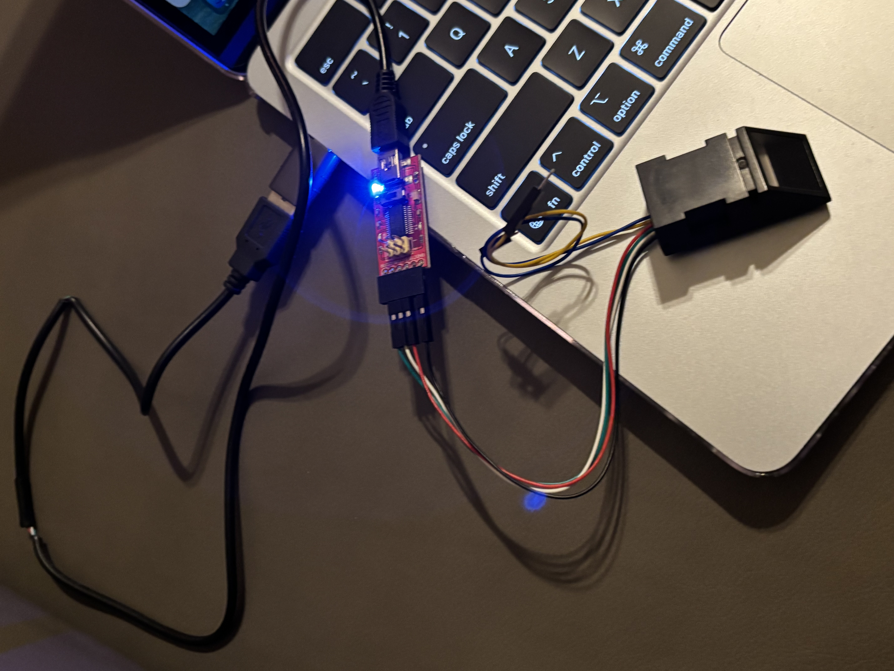
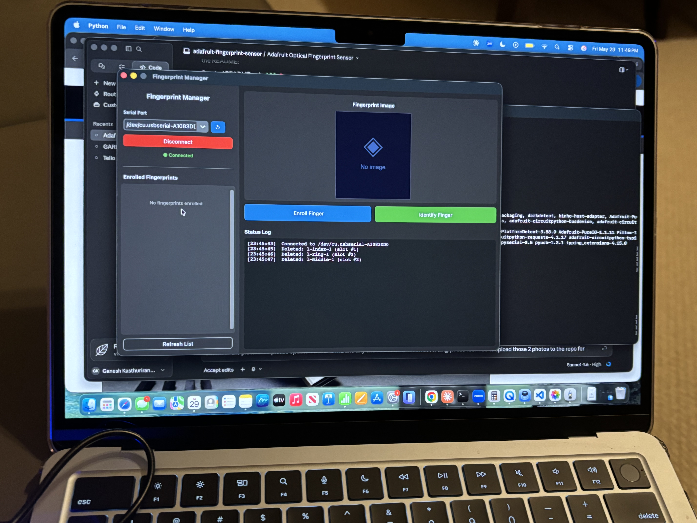
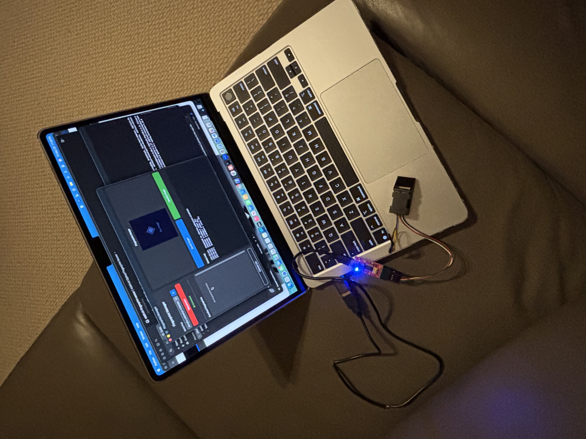

# Adafruit Optical Fingerprint Sensor — Python GUI

A desktop Python application for enrolling, identifying, and managing fingerprints using the [Adafruit Optical Fingerprint Sensor](https://www.adafruit.com/product/751) connected to a Mac (or Linux/Windows) via a USB-to-Serial TTL adapter.

---

## Privacy & Biometric Data

> **All fingerprint biometric data is stored exclusively on the sensor's hardware EEPROM.** No fingerprint images, templates, or raw biometric data are ever written to disk or transmitted over a network.

The only file persisted locally is `data/fingerprints.json`, which maps sensor slot numbers to the human-readable names you assign during enrollment (e.g. `{"1": "John"}`). This file contains **no biometric information** and is excluded from version control via `.gitignore`.

---

## Hardware

| Component | Notes |
|-----------|-------|
| [Adafruit Optical Fingerprint Sensor](https://www.adafruit.com/product/751) | Product #751 |
| FT232 (FTDI) USB to Serial Adapter | Inland FT232RL or equivalent — **voltage switch must be set to 3.3 V** |

### Setup photos

| | |
|---|---|
|  |  |
|  |  |
|  | |

### Wiring

The FT232RL adapter has a 6-pin header. Wire it to the fingerprint sensor as follows:

| Sensor pin | FT232 header pin | Wire colour (typical) |
|------------|------------------|-----------------------|
| VCC | VCC | Red |
| GND | GND | Black |
| TX | RX | White |
| RX | TX | Green |

> **Important:** Set the voltage switch on the FT232 adapter to **3.3 V** before connecting. The fingerprint sensor operates at 3.3 V logic — using 5 V may damage it.

The sensor communicates at **57600 baud** by default.

On macOS, the adapter enumerates as `/dev/tty.usbserial-*` (FTDI driver). The app auto-detects it in the port dropdown.

---

## Software Requirements

- Python 3.10+
- macOS, Linux, or Windows

### Python dependencies

```
adafruit-circuitpython-fingerprint
pyserial
customtkinter
Pillow
```

---

## Installation

```bash
git clone https://github.com/gkrangan/adafruit-fingerprint-sensor.git
cd adafruit-fingerprint-sensor

python3 -m venv .venv
source .venv/bin/activate          # macOS / Linux
# .venv\Scripts\activate           # Windows

pip install -r requirements.txt
```

---

## Running

```bash
source .venv/bin/activate
python3 main.py
```

---

## Features

| Feature | Description |
|---------|-------------|
| **Enroll** | 2-scan enrollment — enter a name, place finger twice, template saved to sensor |
| **Identify** | Place finger to search the sensor's on-board template database; shows matched name and confidence score |
| **Delete** | Remove individual enrolled fingerprints from the sensor with a single click |
| **Fingerprint image** | Live grayscale image of the scanned fingerprint, rendered after each operation |
| **Status log** | Timestamped log of all operations and sensor responses |

---

## Project Structure

```
adafruit-fingerprint-sensor/
├── main.py          # Entry point
├── app.py           # customtkinter GUI
├── sensor.py        # FingerprintSensor — wraps adafruit_fingerprint library
├── storage.py       # Maps sensor slot IDs to user-assigned names (JSON)
├── images/          # Hardware and setup photos
├── data/
│   └── .gitkeep     # fingerprints.json written here at runtime (gitignored)
└── requirements.txt
```

---

## Notes

- The sensor stores up to **127 fingerprint templates** in its internal flash memory.
- Fingerprint templates persist on the sensor across power cycles; they are independent of this application.
- The `data/fingerprints.json` name-mapping file is local to your machine and gitignored. If you delete it, enrolled slots on the sensor will show as `ID #N` until you reassign names.
